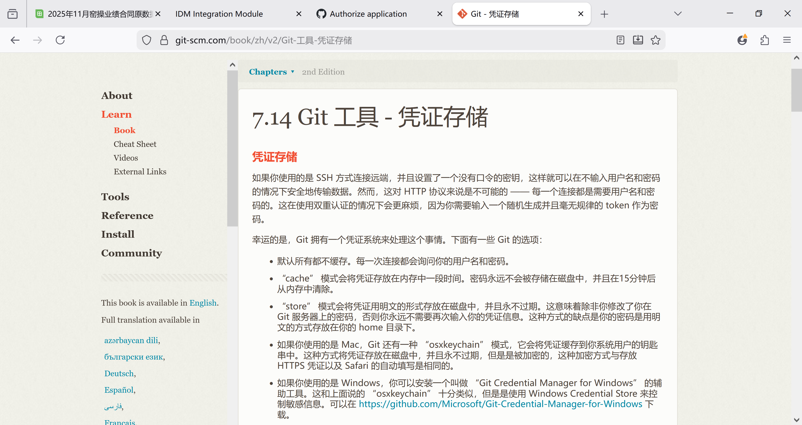

原来没有加入插件，插入图片的引用公式是错的hhh ![[../Test/Pasted image 20251207171655.png]]加入了插件后：
就能看见了
插件是
应该可以吧确定了可以看见，然后[小tips](../Test/git的改名，github上改了仓库名，但本地文件不改名.md)
[如何查看Obsidian文件的反向链接](../如何查看Obsidian文件的反向链接.md)就能看到文件的链接和反向链接了

